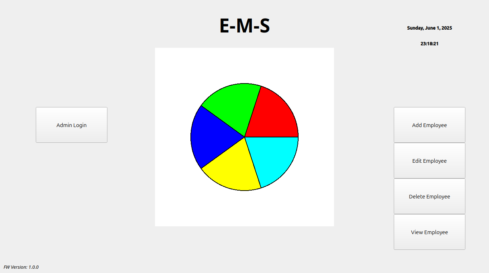

# EMS

EMS (Employee Management System) is a lightweight desktop application developed in C++ and Qt for efficiently managing and tracking employee records. It provides functionality to add, edit, remove, and view employees, capturing essential details such as name, ID, department and salary.

